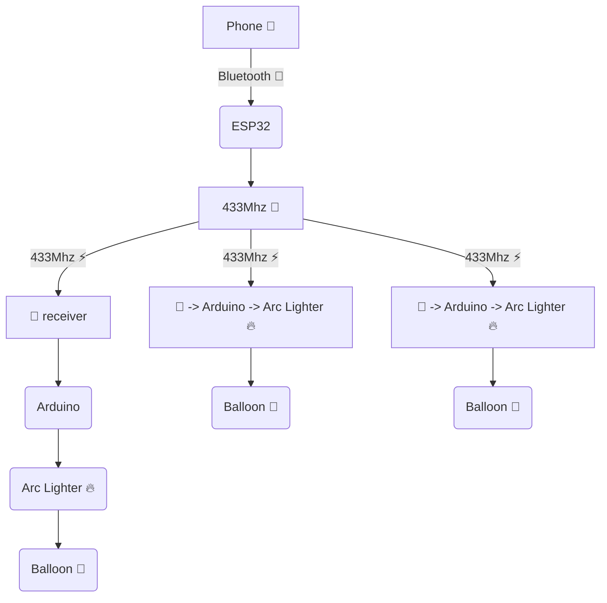

# flare-cast 🔥🛜

Remote control flares

## General idea

```mermaid
flowchart TD
    A["Phone 📱"] -->|"Bluetooth 🛜"| B(ESP32)
    B --> C["433Mhz 📡"]
    C -->|"433Mhz ⚡️"| D["📡 receiver"]
    D --> E("Arduino")
    E --> F("Arc Lighter 🔥")
    F --> G("Balloon 🎈")
    C -->|"433Mhz ⚡️"| H["📡 -> Arduino -> Arc Lighter 🔥"]
    H --> I("Balloon 🎈")
    C -->|"433Mhz ⚡️"| L["📡 -> Arduino -> Arc Lighter 🔥"]
    L --> M("Balloon 🎈")
```

